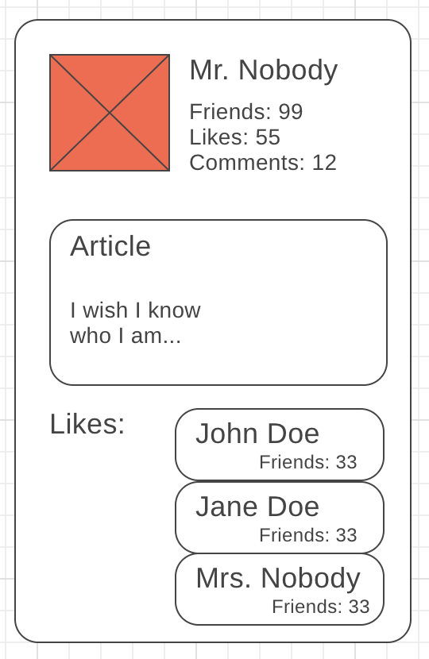

import { Head, Appear, Notes } from "mdx-deck";
import { Split } from 'mdx-deck/layouts'
export { default as theme } from './theme'

<Head>
  <title>Presentation Title</title>
</Head>

# What can GraphQL do for app developers

---

## Who am I

---

<h3>Saša Pul</h3>

<ul>
  <Appear>
    <li>fullstack dev @Freska</li>
    <li>not an IOS, or mac developer</li>
    <li>startred using GraphQL roughly 6 months ago</li>
    <li>my first public talk</li>
  </Appear>
</ul>


```notes
- fullstack means I do JS, and it spans both FE and BE
- first talk - please be gentle :) 
- NOT a gql expert :)

```
---

## What is GraphQL?

```notes
- who has heard of it
- who has used it?
- used it as a consumer or created an API
```
---

<h3>Strongly typed query language for your API</h3>

<Appear>
    <h3>And a server-side runtime for executing queries...</h3>
    <h3>...by using a type system you define for your data.</h3>
</Appear>

```notes
- strongly typed: if type validation fails, request fails
```
---

<h3>More efficient alternative to REST</h3>

<ul>
  <Appear>
    <li>Created (2012.) and opensourced by Facebook (2015.)</li>
    <li>Enables declarative data fetching</li>
    <li>Exposes a single endpoint</li>
    <li>Not limited to frontend/react</li>
  </Appear>
</ul>

```notes
- first used for FB native mobile app
- spec, and graphqlJS by FB
- announced by FB on react conf, so there was a confusion about it and it was not often mentioned in context of mobile apps 
```
---

<h3>Implementations</h3>

<ul>
  <Appear>
    <li>Client</li>
    <ul><li>C#, Clojurescript, Go, Java (Android), JavaScript, <strong>Swift/Objective-C</strong>, Python...</li></ul>
    <li>Server</li>
    <ul><li>C#, Clojure, Elixir, Erlang, Go, Groovy, Java, JavaScript, PHP, Python, Scala, Ruby...</li></ul>
  </Appear>
</ul>

---

<a href="https://graphql.org/users/" target="_blank"><h3>Usage in production</h3></a>

```notes
- sure to spot some familiar logos
```
---
<h3>Advantages over REST</h3>
<ul>
  <Appear>
    <li>more efficient data fetching</li>
    <li>no need for versioning</li>
    <li>composing APIs</li>
    <li>powerful analytics</li>
  </Appear>
</ul>

```notes
- versioning:
  - no need to adjust API with every product requirement or design change
  - if new data is needed, simply add it to the schema, and those who need it will use it
- composing: use several different resources, or even combine multiple graphql APIs
  - exapmle: use your backend API alongside contentful (or whatever CMS) API
- analytics:
  - able to track what data is requested by clients
  - evolve and deprecate
```
---
export default Split



<Appear>
<pre>users/[id]/</pre>
<pre>users/[id]/posts/</pre>
<pre>posts/[id]/</pre>
<pre>users/[id]/</pre>
<pre>users/[id]/</pre>
<pre>users/[id]/</pre>
</Appear>

```notes
- no overfetching / underfetching
- overfetching: downloading unnecessary data
- underfetching: not getting enough data, need to make subsequent requests
- depending on the backend api, data loader or a specific db query will batch all user requests
```
---
export default Split


```json
{
  query($id: Number) {
    users(id: $id) {
      friendsCount
      likes
      commentsCount
      photo
      posts {
        content
        likes {
          users {
            name
            friendsCount
          }
        }
      }
    } 
  }
}
```
---

## How does it work

---

### Core elements

- schema
  - the 'contract'
  - defined by SDL

- resolver

- resolver functions 

---

### Some specific concepts

---

## Resources

---

### Thank you

#### The End